# Diagrama de Casos de Uso - Node_api (Aplicación Financiera)

## Descripción General
Este diagrama representa los 24 casos de uso de una aplicación de administración financiera personal que permite a los usuarios gestionar sus finanzas, incluyendo ingresos, gastos, presupuestos, metas financieras y cuentas bancarias.

---

## Diagrama de Casos de Uso

```mermaid
graph TB
    subgraph "Sistema de Gestión Financiera Personal"
        %% Casos de Uso de Autenticación
        UC1["Registrar Usuario"]
        UC2["Iniciar Sesión"]
        UC3["Gestionar Perfil de Usuario"]
        
        %% Casos de Uso de Cuentas
        UC4["Crear Cuenta Bancaria"]
        UC5["Ver Cuentas"]
        UC6["Actualizar Cuenta"]
        UC7["Eliminar Cuenta"]
        
        %% Casos de Uso de Ingresos
        UC8["Registrar Ingreso"]
        UC9["Ver Ingresos"]
        UC10["Actualizar Ingreso"]
        UC11["Eliminar Ingreso"]
        
        %% Casos de Uso de Gastos
        UC12["Registrar Gasto"]
        UC13["Ver Gastos"]
        UC14["Actualizar Gasto"]
        UC15["Eliminar Gasto"]
        
        %% Casos de Uso de Presupuestos
        UC16["Crear Presupuesto"]
        UC17["Ver Presupuestos"]
        UC18["Actualizar Presupuesto"]
        UC19["Eliminar Presupuesto"]
        
        %% Casos de Uso de Metas
        UC20["Crear Meta Financiera"]
        UC21["Ver Metas"]
        UC22["Actualizar Meta"]
        UC23["Eliminar Meta"]
        
        %% Casos de Uso de Categorías
        UC24["Gestionar Categorías"]
    end
    
    %% Actor
    Usuario["👤 Usuario"]
    
    %% Relaciones Usuario - Casos de Uso
    Usuario --> UC1
    Usuario --> UC2
    Usuario --> UC3
    Usuario --> UC4
    Usuario --> UC5
    Usuario --> UC6
    Usuario --> UC7
    Usuario --> UC8
    Usuario --> UC9
    Usuario --> UC10
    Usuario --> UC11
    Usuario --> UC12
    Usuario --> UC13
    Usuario --> UC14
    Usuario --> UC15
    Usuario --> UC16
    Usuario --> UC17
    Usuario --> UC18
    Usuario --> UC19
    Usuario --> UC20
    Usuario --> UC21
    Usuario --> UC22
    Usuario --> UC23
    Usuario --> UC24
    
    %% Estilos
    classDef userClass fill:#4A90E2,stroke:#2E5C8A,color:#fff
    classDef ucAuth fill:#9B59B6,stroke:#6C3483,color:#fff
    classDef ucAccount fill:#3498DB,stroke:#21618C,color:#fff
    classDef ucIncome fill:#2ECC71,stroke:#1E8449,color:#fff
    classDef ucExpense fill:#E74C3C,stroke:#A93226,color:#fff
    classDef ucBudget fill:#F39C12,stroke:#B9770E,color:#fff
    classDef ucGoal fill:#1ABC9C,stroke:#117A65,color:#fff
    classDef ucCategory fill:#95A5A6,stroke:#5D6D7E,color:#fff
    
    class Usuario userClass
    class UC1,UC2,UC3 ucAuth
    class UC4,UC5,UC6,UC7 ucAccount
    class UC8,UC9,UC10,UC11 ucIncome
    class UC12,UC13,UC14,UC15 ucExpense
    class UC16,UC17,UC18,UC19 ucBudget
    class UC20,UC21,UC22,UC23 ucGoal
    class UC24 ucCategory
```

---

## Descripción de Actores

### 👤 Usuario
Usuario de la aplicación que gestiona sus finanzas personales. Puede:
- Registrarse y autenticarse en el sistema
- Gestionar sus cuentas bancarias
- Registrar y controlar ingresos y gastos
- Crear y dar seguimiento a presupuestos
- Establecer y monitorear metas financieras
- Organizar transacciones usando categorías

---

## Casos de Uso Detallados

### 🔐 Autenticación y Gestión de Usuario

| Caso de Uso | Descripción | Endpoints |
|-------------|-------------|-----------|
| **UC1: Registrar Usuario** | Permite a un nuevo usuario crear una cuenta en el sistema con credenciales cifradas | `POST /api/users` |
| **UC2: Iniciar Sesión** | Autenticación de usuario mediante credenciales y generación de token JWT | `POST /api/users/login` |
| **UC3: Gestionar Perfil** | Ver, actualizar o eliminar el perfil de usuario | `GET/PUT/DELETE /api/users/:id` |

### 💳 Gestión de Cuentas Bancarias

| Caso de Uso | Descripción | Endpoints |
|-------------|-------------|-----------|
| **UC4: Crear Cuenta** | Registrar una nueva cuenta bancaria (corriente, ahorros, etc.) | `POST /api/accounts` |
| **UC5: Ver Cuentas** | Listar todas las cuentas del usuario | `GET /api/accounts` |
| **UC6: Actualizar Cuenta** | Modificar información de una cuenta existente | `PUT /api/accounts/:id` |
| **UC7: Eliminar Cuenta** | Eliminar una cuenta del sistema | `DELETE /api/accounts/:id` |

### 💰 Gestión de Ingresos

| Caso de Uso | Descripción | Endpoints |
|-------------|-------------|-----------|
| **UC8: Registrar Ingreso** | Registrar un nuevo ingreso (salario, freelance, etc.) | `POST /api/incomes` |
| **UC9: Ver Ingresos** | Consultar historial de ingresos | `GET /api/incomes` |
| **UC10: Actualizar Ingreso** | Modificar un ingreso registrado | `PUT /api/incomes/:id` |
| **UC11: Eliminar Ingreso** | Eliminar un ingreso del historial | `DELETE /api/incomes/:id` |

### 💸 Gestión de Gastos

| Caso de Uso | Descripción | Endpoints |
|-------------|-------------|-----------|
| **UC12: Registrar Gasto** | Registrar un nuevo gasto con categoría asociada | `POST /api/expenses` |
| **UC13: Ver Gastos** | Consultar historial de gastos | `GET /api/expenses` |
| **UC14: Actualizar Gasto** | Modificar un gasto registrado | `PUT /api/expenses/:id` |
| **UC15: Eliminar Gasto** | Eliminar un gasto del historial | `DELETE /api/expenses/:id` |

### 📊 Gestión de Presupuestos

| Caso de Uso | Descripción | Endpoints |
|-------------|-------------|-----------|
| **UC16: Crear Presupuesto** | Definir un presupuesto mensual o por categoría | `POST /api/budgets` |
| **UC17: Ver Presupuestos** | Consultar presupuestos activos | `GET /api/budgets` |
| **UC18: Actualizar Presupuesto** | Modificar límites de presupuesto | `PUT /api/budgets/:id` |
| **UC19: Eliminar Presupuesto** | Eliminar un presupuesto | `DELETE /api/budgets/:id` |

### 🎯 Gestión de Metas Financieras

| Caso de Uso | Descripción | Endpoints |
|-------------|-------------|-----------|
| **UC20: Crear Meta** | Establecer una meta de ahorro con fecha límite | `POST /api/goals` |
| **UC21: Ver Metas** | Consultar progreso de metas financieras | `GET /api/goals` |
| **UC22: Actualizar Meta** | Modificar monto o fecha de meta | `PUT /api/goals/:id` |
| **UC23: Eliminar Meta** | Eliminar una meta financiera | `DELETE /api/goals/:id` |

### 🏷️ Gestión de Categorías

| Caso de Uso | Descripción | Endpoints |
|-------------|-------------|-----------|
| **UC24: Gestionar Categorías** | CRUD completo de categorías para clasificar gastos | `GET/POST/PUT/DELETE /api/categories` |

---

## Flujos Principales

### 📝 Flujo de Registro e Inicio de Sesión
1. Usuario se registra (UC1)
2. Sistema encripta contraseña y crea cuenta
3. Usuario inicia sesión (UC2)
4. Sistema valida credenciales y genera token JWT
5. Usuario accede a funcionalidades del sistema

### 💵 Flujo de Gestión Financiera Básica
1. Usuario crea cuenta bancaria (UC4)
2. Usuario registra ingresos (UC8)
3. Usuario registra gastos con categorías (UC12, UC24)
4. Usuario crea presupuestos para controlar gastos (UC16)
5. Usuario consulta reportes y balances (UC5, UC9, UC13, UC17)

### 🎯 Flujo de Metas de Ahorro
1. Usuario define meta financiera con monto objetivo (UC20)
2. Usuario registra ingresos periódicos (UC8)
3. Usuario controla gastos mediante presupuestos (UC16)
4. Usuario monitorea progreso hacia la meta (UC21)
5. Usuario ajusta meta según sea necesario (UC22)

---

## Consideraciones Técnicas

### Seguridad
- **Autenticación**: JWT (JSON Web Tokens) con expiración de 1 hora
- **Encriptación**: Contraseñas hasheadas con bcryptjs y salt
- **Validación**: Middleware de verificación de estado de usuario

### Relaciones entre Entidades
- **Usuario** → tiene muchas → **Cuentas, Ingresos, Gastos, Presupuestos, Metas**
- **Gasto** → pertenece a → **Categoría, Cuenta, Presupuesto**
- **Ingreso** → pertenece a → **Cuenta**
- **Usuario** → tiene un → **Rol, Estado**

### Stack Tecnológico
- **ORM**: Sequelize
- **Base de Datos**: SQL (PostgreSQL/MySQL)
- **Backend**: Node.js + Express
- **Autenticación**: JWT + bcryptjs
